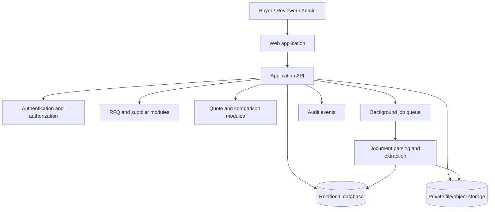

# RFQ Intelligence Platform

> A proposed platform for organizing Requests for Quotation (RFQs), comparing supplier offers, and turning sourcing data into clear, auditable decisions.

**Project status:** Product concept / implementation blueprint. This README describes the intended product and a recommended architecture; it does not claim that a production application or a particular technology stack already exists.

---

## Contents

- [Overview](#overview)
- [The problem](#the-problem)
- [Goals](#goals)
- [How the platform works](#how-the-platform-works)
- [Product structure](#product-structure)
- [Proposed technical architecture](#proposed-technical-architecture)
- [Suggested repository structure](#suggested-repository-structure)
- [Key data concepts](#key-data-concepts)
- [How to use the platform](#how-to-use-the-platform)
- [Design decisions and rationale](#design-decisions-and-rationale)
- [Advantages](#advantages)
- [MVP scope and future roadmap](#mvp-scope-and-future-roadmap)
- [Security, privacy, and responsible AI](#security-privacy-and-responsible-ai)
- [Suggested success metrics](#suggested-success-metrics)
- [Development status and local setup](#development-status-and-local-setup)
- [License](#license)

## Overview

An **RFQ (Request for Quotation)** is a formal request a buyer sends to potential suppliers asking them to quote for specified goods or services. Replies may contain prices, quantities, delivery estimates, payment terms, warranties, and exceptions—often in different formats and with inconsistent wording.

The RFQ Intelligence Platform is intended to give procurement teams one place to:

1. Create and manage sourcing events.
2. Invite suppliers and collect their offers.
3. Extract and normalize information from quote documents.
4. Compare offers on a like-for-like basis.
5. Review exceptions, risks, and missing information.
6. Record a transparent, human-approved sourcing decision.
7. Learn from historical RFQs and supplier performance.

The platform is **decision support**, not an autonomous purchasing authority. People remain responsible for reviewing quotes, selecting suppliers, and approving commitments.

## The problem

RFQ work is frequently spread across email, spreadsheets, shared folders, and procurement systems. That leads to:

- Manual copy-and-paste between supplier documents and comparison sheets.
- Difficult comparisons when suppliers use different units, currencies, or quote formats.
- Missed exclusions, long lead times, expiring offers, or non-standard terms.
- Repeated clarification emails and unclear ownership of follow-ups.
- Limited visibility into historical prices and supplier reliability.
- Weak audit trails explaining why a particular supplier was selected.

The platform aims to reduce this friction while keeping the underlying evidence available to users.

## Goals

### Primary goals

- Make RFQ status, owners, suppliers, and deadlines visible.
- Reduce the time needed to turn quote documents into a comparable view.
- Highlight material differences and potential issues for human review.
- Preserve source documents, extracted values, corrections, and approvals.
- Make past RFQ and supplier data useful for future sourcing events.

### Non-goals for the first release

- Automatically signing contracts, issuing purchase orders, or committing company funds.
- Replacing an organization's ERP, accounting, contract-management, or supplier-master system.
- Claiming that AI extraction is always correct or that a recommendation is unbiased.
- Supporting every procurement category, jurisdiction, integration, and document format on day one.

## How the platform works


A typical RFQ passes through statuses such as **Draft → Open → Responses Received → Under Review → Awarded / Closed**. A team may also use **Cancelled** or **Expired**. Status changes should be timestamped and attributable to a user.

## Product structure

### 1. Dashboard

- RFQs needing attention, upcoming deadlines, and overdue actions.
- A summary of open events, received quotes, and pending approvals.
- Filters by owner, business unit, category, status, and date.

### 2. RFQ workspace

- RFQ title, description, requester, owner, category, currency, and timeline.
- Line items with specifications, quantities, units, and required delivery dates.
- Supplier invitation list, Q&A, addenda, and event activity log.
- Attachments and the current status of each supplier response.

### 3. Supplier and response management

- Supplier contact and profile details, subject to the organization's data policies.
- Quote submission and supporting attachments.
- Response timestamps, validity periods, clarifications, and missing fields.
- A distinction between supplier-provided facts and internally recorded assessments.

### 4. Quote extraction and validation

- Import supported documents or enter quote information manually.
- Extract candidate line-item prices, totals, delivery terms, payment terms, warranties, and exclusions.
- Display confidence or review indicators where available.
- Let a buyer verify or edit extracted values and inspect the source document/page.
- Keep a record of corrected values rather than silently replacing original evidence.

### 5. Comparison workspace

- Side-by-side supplier and line-item comparison.
- Clearly labeled price basis, currency, unit, quantity, and assumptions.
- Total-cost view with configurable components such as shipping, taxes, or setup fees.
- Flags for missing responses, quote expiry, deviations, and terms needing attention.
- Optional weighted evaluation criteria, with weights and scoring rationale visible to reviewers.

### 6. Decision and audit history

- Shortlist, clarification, evaluation, approval, and award records.
- Reviewer comments and documented rationale.
- Change history for material fields and decisions.
- Exportable comparison summary for internal review.

### 7. Analytics (later stage)

- Price and lead-time trends across comparable RFQs.
- Supplier response, on-time delivery, and award history.
- Category-level summaries and potential savings estimates.
- Benchmarks only when the data is sufficiently comparable and permitted for that purpose.

## Proposed technical architecture

A sensible first implementation is a **modular monolith**: one application divided into clear business modules, with background jobs for slower document-processing work. This is easier to build, test, and deploy than starting with many microservices, while leaving room to separate high-load modules later.



### Suggested application modules

- **Identity and access:** users, organizations, roles, and permissions.
- **RFQ management:** events, requirements, line items, deadlines, and statuses.
- **Supplier management:** supplier records and event invitations.
- **Response management:** submissions, documents, clarifications, and quote validity.
- **Document processing:** safe file intake, text extraction, field candidates, and review states.
- **Comparison and evaluation:** normalized comparisons, criteria, scores, and notes.
- **Approvals and audit:** approval steps, decision rationale, and event history.
- **Notifications and reporting:** reminders, exports, and summaries.

### Technology choices

No implementation stack is established in this environment. Select technologies that fit the team's skills and deployment constraints. A practical stack should provide:

- A maintainable web frontend and typed or well-structured server API.
- A relational database for connected procurement records and transaction integrity.
- Private object storage for original quote files.
- A background job system for document parsing, extraction, and notifications.
- An authentication provider or secure, well-maintained authentication library.

The important architectural choice is not a particular framework: it is to keep **business records structured**, **source files private**, and **AI/document processing asynchronous and reviewable**.

## Suggested repository structure

This is a proposed layout, not a listing of files that currently exist:

```text
rfq-intelligence/
├── README.md
├── docs/
│   ├── architecture.md
│   ├── data-model.md
│   ├── security-and-privacy.md
│   └── product-roadmap.md
├── apps/
│   ├── web/                 # Buyer and reviewer interface
│   └── api/                 # Application API and domain logic
├── workers/
│   └── document-processing/ # Parsing, extraction, and async jobs
├── packages/
│   ├── shared-types/        # Shared schemas and API types
│   └── design-system/       # Reusable interface components
├── migrations/              # Versioned database changes
├── tests/
│   ├── unit/
│   ├── integration/
│   └── end-to-end/
├── .env.example             # Names/placeholders only; no real secrets
└── LICENSE                  # Full GNU AGPL v3.0 license text
```

For a small first version, the API and worker can live in one application repository and be separated by modules rather than deployed as independent services.

## Key data concepts

A relational model could include the following entities. The actual schema should be refined to fit the first customer and procurement workflow.

| Entity | Purpose | Typical relationships |
|---|---|---|
| Organization | Tenant or company using the platform | Has users, RFQs, and suppliers |
| User | Person working in an organization | Has role and activity history |
| RFQ | Sourcing event with dates, currency, owner, and status | Has line items, invitations, and responses |
| RFQ line item | A requirement being quoted | Belongs to an RFQ; receives supplier quote lines |
| Supplier | Organization invited to quote | Can respond to multiple RFQs |
| Invitation | Records a supplier's participation in an RFQ | Links a supplier to an RFQ |
| Response | Supplier's submission to a particular RFQ | Has documents, quote lines, and terms |
| Quote line | A supplier's offer for a requested line item | Links response to RFQ line item |
| Document | Original quote file and metadata | Belongs to a response or RFQ |
| Extracted field | Candidate value extracted from a document | References source evidence and review status |
| Evaluation | Criteria, scores, and reviewer notes | Links a supplier response to a review |
| Approval | Approval step and outcome | Belongs to a decision or RFQ |
| Audit event | Append-oriented record of a significant action | Identifies actor, time, and affected record |

The model should keep **requested requirements** distinct from **supplier-offered values**. That distinction is essential for fair comparisons and for identifying deviations.

## How to use the platform

### Buyer workflow

1. **Create an RFQ.** Enter the title, scope, currency, owner, response deadline, and any instructions.
2. **Add requirements.** Specify each line item, quantity, unit, required specifications, and delivery expectations.
3. **Invite suppliers.** Select suppliers and set the response window. Record any communications or addenda in the RFQ workspace.
4. **Collect responses.** Upload or receive supplier quotes and attach the original files to the relevant response.
5. **Review extracted information.** Check prices, totals, terms, and exceptions against the source documents. Correct extraction errors before using the comparison.
6. **Compare offers.** Review normalized costs and terms. Confirm that units, currencies, quantities, and assumptions are aligned.
7. **Resolve questions.** Request clarification where information is missing or ambiguous and capture the response.
8. **Evaluate and approve.** Apply the team's criteria, document the rationale, and obtain any required approvals.
9. **Record the outcome.** Mark the RFQ awarded, closed, cancelled, or otherwise resolved; retain the decision trail.
10. **Reuse learning.** Use historical records to inform future RFQs where the comparison is fair and permitted.

### Supplier workflow (if supplier access is enabled)

1. Open the RFQ invitation.
2. Review requirements, deadlines, and addenda.
3. Ask clarification questions through the event channel.
4. Submit a quote and supporting documents before the deadline.
5. Update or withdraw a response according to the event rules.

Supplier-facing access is optional; an initial deployment can instead let buyers manage supplier responses internally.

### Reviewer workflow

- Open the RFQ comparison and inspect original quote evidence.
- Review exceptions and any extracted values marked for validation.
- Add evaluation notes and scores using the published criteria.
- Approve, request clarification, or return the evaluation for changes.

## Design decisions and rationale

### 1. Structured data plus original documents

**Decision:** Store quote facts in structured fields while retaining the supplier's source documents.

**Why:** A spreadsheet-like comparison needs normalized values, but source documents are necessary to verify context, exceptions, and extraction accuracy. Keeping both makes the system more useful and auditable.

### 2. AI assists; buyers verify

**Decision:** Treat automated extraction and summaries as suggestions that require review for important decisions.

**Why:** Supplier documents vary widely, and a subtle error in quantity, currency, or an exclusion could change a sourcing decision. Evidence and human review reduce the chance of an unnoticed mistake.

### 3. Separate requested specifications from offered terms

**Decision:** Model the RFQ requirement separately from each supplier's quote.

**Why:** This exposes non-conforming offers instead of making unlike proposals appear equivalent.

### 4. Normalize carefully; preserve the basis

**Decision:** Show currency, unit, quantity, time period, and calculation assumptions wherever a comparison is shown.

**Why:** “Cheapest” is not meaningful when quotes use different currencies, units, delivery terms, or included services. Any currency conversion or total-cost calculation should identify its rate/source and assumptions.

### 5. Human-controlled evaluation

**Decision:** Keep evaluation criteria, weights, scores, and award approval visible to authorized people.

**Why:** A recommendation should be explainable and contestable. Teams should understand which factors influenced an evaluation and retain authority over the award.

### 6. Auditability from the start

**Decision:** Record significant changes, approvals, and decision rationale with actor and timestamp.

**Why:** Procurement decisions may need internal review later. A useful audit trail is easier to build into workflows from the beginning than to reconstruct afterward.

### 7. Modular monolith for the first release

**Decision:** Begin with cohesive modules in a single deployable application, adding background jobs where processing is slow.

**Why:** It limits operational complexity while the product and user workflow are still being validated. Modules can be extracted into services if scale or team boundaries later justify it.

### 8. MVP before broad integrations

**Decision:** First prove the core create → collect → compare → approve loop; add ERP, email, and supplier-network integrations after validating real needs.

**Why:** Integrations add support, security, and maintenance work. A focused workflow tests the product's main value sooner.

## Advantages

- **Less manual work:** Reduce repetitive copying and comparison-sheet preparation.
- **Faster decisions:** Give reviewers one view of price, lead time, terms, and exceptions.
- **More consistent sourcing:** Reuse templates, requirements, and evaluation criteria.
- **Fewer overlooked differences:** Make missing fields, deviations, and quote expiry visible.
- **Better traceability:** Keep quote sources, corrections, approvals, and rationale together.
- **Improved supplier insight:** Build a history of response quality, pricing, and delivery performance.
- **More defensible comparisons:** Show calculation assumptions and distinguish offered terms from requested ones.
- **Room to grow:** Start with one team's workflow and add integrations, analytics, and more advanced automation as needed.

These are intended benefits; realized improvements depend on implementation quality, data quality, adoption, and the organization's procurement process.

## MVP scope and future roadmap

### MVP — prove the core workflow

- Organization and user access with basic role permissions.
- Create/edit RFQs, requirements, deadlines, and line items.
- Add suppliers and track invitations/responses.
- Upload quote files and manually record or review quote data.
- Side-by-side comparison with clear units and currencies.
- Mark exceptions, request clarification, and record evaluation notes.
- Approval/award record, activity history, and basic export.

### Next — automate repetitive work

- Document text extraction and structured field suggestions.
- Review queue for uncertain or incomplete extracted values.
- Email notifications and deadline reminders.
- Reusable RFQ and evaluation templates.
- More complete permissions and configurable approval flows.

### Later — connected intelligence

- ERP or purchasing-system integrations.
- Supplier self-service portal.
- Historical benchmarks and category analytics.
- Configurable total-cost-of-ownership calculations.
- Carefully governed AI-assisted summaries and anomaly flags.

Prioritize roadmap items using customer evidence, security readiness, and measurable reduction in procurement effort—not novelty alone.

## Security, privacy, and responsible AI

RFQs can contain confidential prices, supplier information, and commercially sensitive terms. A production implementation should include:

- Tenant isolation and least-privilege role-based access.
- Private file storage, short-lived signed links, and file access checks.
- Encryption in transit and at rest, with secure secret management.
- File type/size validation, malware scanning where available, and safe document processing.
- Audit logging for sensitive access and material changes.
- Retention, deletion, and export policies aligned with customer agreements and applicable law.
- Data minimization when using external document or AI services; disclose subprocessors and processing terms.
- Protection against prompt injection and untrusted instructions embedded in supplier documents.
- Human validation for high-impact extracted fields and decisions.
- No use of one customer's confidential quote data to expose another customer's information or train shared models without explicit authorization.

This README is not legal advice or a security certification. Requirements should be reviewed for the deployment jurisdiction and customer context.

## Suggested success metrics

Measure the product against a baseline rather than assuming benefits. Useful metrics include:

- Time from RFQ creation to completed comparison.
- Buyer minutes spent on data entry per supplier response.
- Percentage of responses with complete, validated comparison data.
- Number of clarification cycles and time to resolve them.
- Percentage of decisions with recorded rationale and required approvals.
- Extraction correction rate by field type and document format.
- User adoption and supplier response completion rate.

Avoid treating lowest quoted price or AI extraction confidence as the only measure of success; delivery, quality, compliance, and fit may also matter.

## Development status and local setup

**No application source code or established technology stack was present in the workspace when this README was prepared.** Therefore, project-specific install, build, and run commands are intentionally not invented.

When implementation begins:

1. Choose the stack, hosting target, and initial user workflow.
2. Add the application and worker source code using the proposed structure above (or document a different structure here).
3. Provide an `.env.example` containing variable names and safe placeholders only.
4. Add exact setup, migration, test, and run commands for the selected stack.
5. Document supported file types, size limits, access roles, and known limitations.
6. Add automated tests for tenant isolation, permissions, quote normalization, and approval flows.

## License

This project is licensed under the **GNU Affero General Public License v3.0 (AGPL-3.0)**. The full license text should be included in the repository's root-level [`LICENSE`](LICENSE) file. For the license terms, see the [GNU AGPL v3.0](https://www.gnu.org/licenses/agpl-3.0.html).

AGPL-3.0 is a strong copyleft license. In general, when you convey or distribute a covered work, you must provide recipients the corresponding source code under the license terms. Section 13 also requires a person who modifies the program and lets users interact with that modified version remotely over a network to offer those users the corresponding source code for that modified version. Review the complete license for the exact requirements; this summary is not legal advice.

When distributing the platform, retain applicable copyright and license notices, include the AGPL-3.0 license text, and make required source-code offers. Check third-party dependency licenses separately. If you have not yet added the root `LICENSE` file, add the official AGPL-3.0 text before distributing the project as licensed.

---

**In one sentence:** The RFQ Intelligence Platform is designed to make supplier quotations easier to collect, verify, compare, and explain—while leaving purchasing decisions accountable to people.
